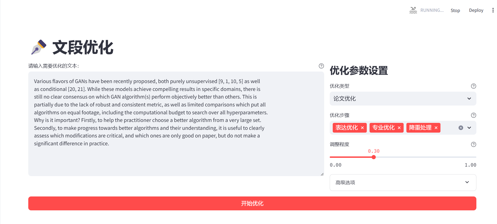
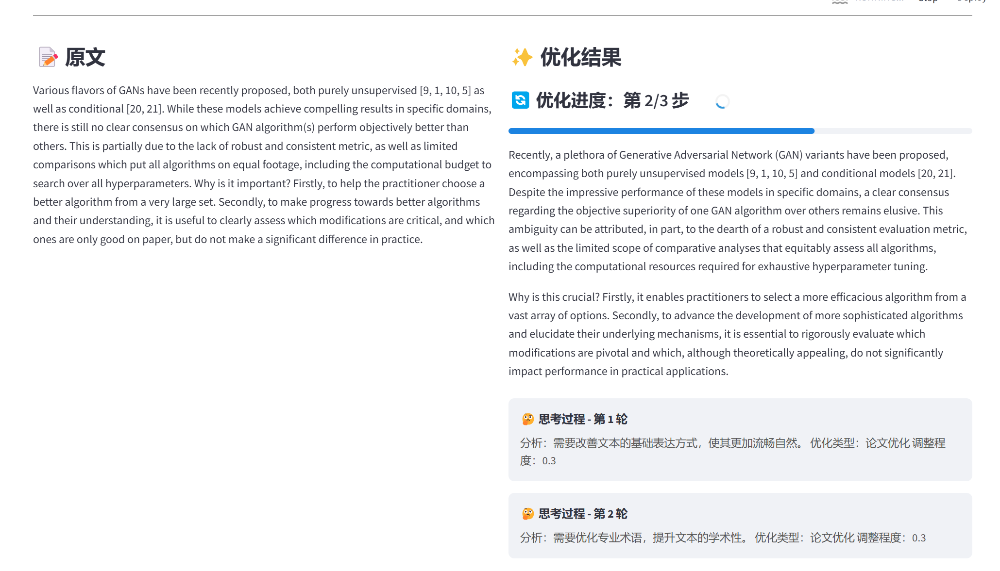
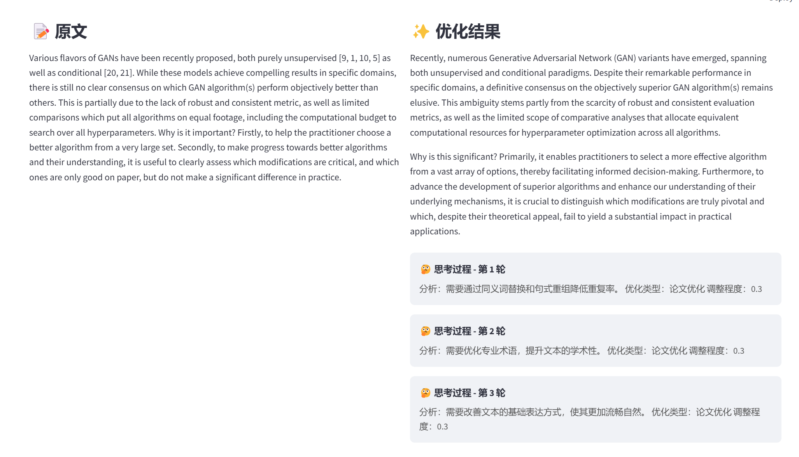
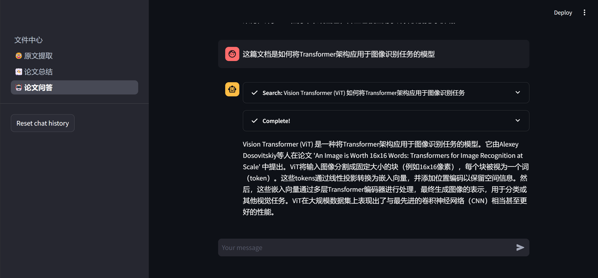
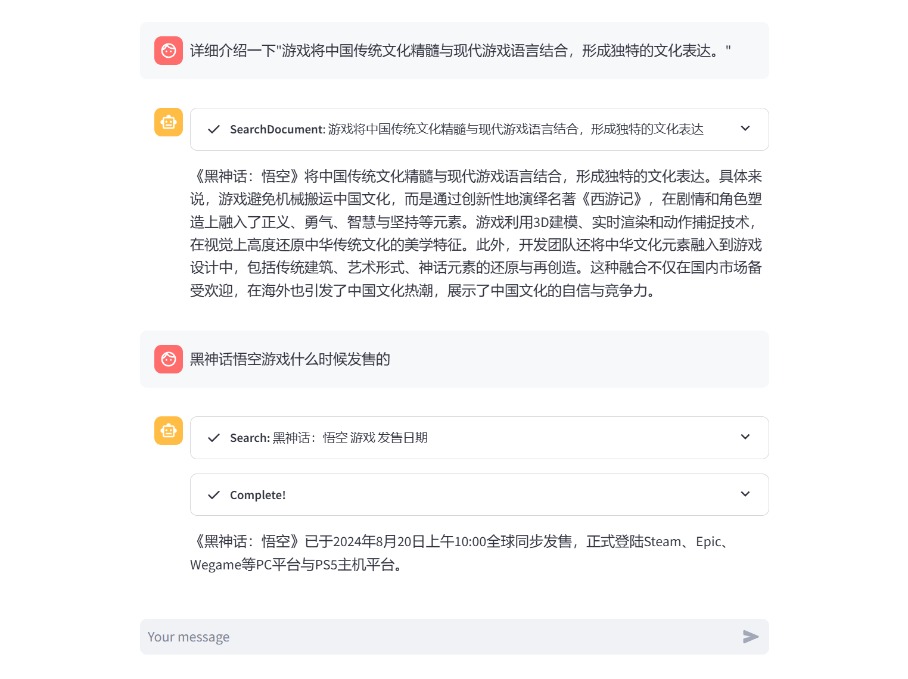
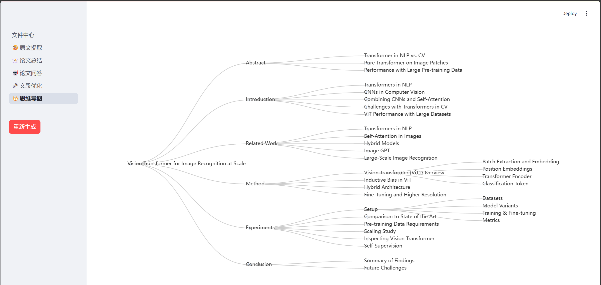

# 文献阅读助手 (Literature Reading Assistant) v2.0

[](https://www.python.org/downloads/)
[](https://streamlit.io/)
[](LICENSE)
[](https://github.com/astral-sh/ruff)
[](#测试)
[](.github/workflows/ci.yml)

[English](README_EN.md) | 简体中文

一个基于人工智能的文献阅读辅助工具，帮助研究人员和学生更高效地阅读、理解和分析学术文献。采用模块化架构，提供完整的企业级开发体验。

## ✨ 主要特性

### 🔐 用户系统
- 完整的用户认证（注册/登录）
- 基于令牌的安全认证
- 支持用户自定义 API Key

### 📁 文件管理中心
- 支持多种格式（PDF、DOC、DOCX、TXT）
- 文件去重（基于 MD5）
- 文件安全存储和管理

### 📑 智能文献分析
- 🔍 **关键文本提取**：自动提取并分类关键内容（研究背景、目的、方法、结论、展望）
- 📝 **智能总结**：生成结构化文献摘要
- 💬 **交互式问答**：基于文献内容回答问题
- ✏️ **文段优化**：
  - 文本润色和清晰度提升
  - 智能降重和改写
  - 学术写作风格增强
  - 文本翻译（中文/英文）

### 🗺️ 可视化思维导图
- 基于 pyecharts 的交互式可视化
- 直观展示文献结构和关键概念
- 支持层级导航和节点展开

### 🛡️ 企业级特性
- **模块化架构**：遵循 Python 最佳实践的 src/ 布局
- **类型安全**：100% 类型注解覆盖
- **全面测试**：67%+ 测试覆盖率，100+ 单元测试
- **代码质量**：集成 Ruff、MyPy、Bandit 自动检查
- **CI/CD**：GitHub Actions 自动化流水线
- **完整文档**：架构文档、API 参考、迁移指南

## 🚀 快速开始

### 环境要求

- **Python**: 3.9+ (推荐 3.11)
- **uv**: 现代 Python 包管理器 ([安装指南](https://docs.astral.sh/uv/))
- **可选**: Redis (默认使用内存模式，可配置启用)

### 💡 队列模式说明

项目支持两种任务队列模式：

**1. 内存模式 (默认，推荐)**
- ✅ 无需安装 Redis
- ✅ 零配置，开箱即用
- ✅ 适合开发和中小规模使用
- ⚠️ 应用重启后任务历史丢失

**2. Redis 模式 (可选)**
- ✅ 任务持久化，重启后恢复
- ✅ 支持多进程/多实例
- ✅ 更好的性能和可靠性
- ⚠️ 需要安装和配置 Redis

**启用 Redis 模式**:
```bash
export USE_REDIS=true
# 或创建 .env 文件并添加: USE_REDIS=true
```

### 推荐：使用 Makefile (最简单)

```bash
# 1. 检查并安装所有依赖（自动完成）
make setup

# 2. 运行测试
make test

# 3. 启动应用
make run
```

### 手动安装

#### 1. 克隆仓库

```bash
git clone <仓库地址>
cd LLM_App_Final
```

#### 2. 检查系统依赖

```bash
# 检查 Python (需要 3.9+)
python3 --version

# 检查并安装 uv
make check-deps
# 或手动安装:
curl -LsSf https://astral.sh/uv/install.sh | sh
```

#### 3. 设置开发环境

```bash
# 自动设置（推荐）
make setup

# 或手动步骤：
# 安装依赖
uv sync --all-extras --dev

# 安装 pre-commit 钩子
pre-commit install

# 创建必要目录
mkdir -p uploads logs
```

#### 4. 配置 API Key

**方式 1：环境变量**

```bash
export DASHSCOPE_API_KEY='your_api_key_here'
```

**方式 2：通过应用设置**
- 在应用侧边栏中配置您的 API Key

#### 5. 启动应用

```bash
# 使用 Makefile（推荐）
make run

# 或直接使用 uv
uv run streamlit run app.py
```

#### 6. 访问应用

打开浏览器访问 `http://localhost:8501`

---

### 🛠️ Makefile 命令参考

```bash
# 开发环境
make setup              # 初始化开发环境（一次性）
make check-deps         # 检查系统依赖 (Python, uv, Redis)
make check-redis        # 检查 Redis 服务状态
make show-config-redis  # 显示 Redis 配置信息

# 代码质量
make lint               # 代码检查 (Ruff)
make lint-fix           # 自动修复代码问题
make type-check         # 类型检查 (MyPy)
make security-check     # 安全检查 (Bandit)
make check-all          # 运行所有质量检查

# 测试
make test               # 运行所有测试
make test-fast          # 快速测试（跳过集成测试）
make test-unit          # 仅单元测试
make test-integration   # 仅集成测试

# 运行
make run                # 启动应用
make run-dev            # 开发模式（自动重载）

# Docker
make docker-build       # 构建 Docker 镜像
make docker-compose-up  # 使用 Docker Compose 启动

# 查看所有命令
make help
```

## 📁 项目结构

```
LLM_App_Final/
├── src/                          # ✅ 源码 (模块化架构)
│   └── llm_app/
│       ├── core/                 # 核心业务逻辑
│       │   ├── auth.py          # 用户认证
│       │   ├── database.py      # 数据库操作
│       │   ├── file_handler.py  # 文件处理
│       │   ├── text_processor.py # 文本分析
│       │   ├── optimizer.py     # 文本优化
│       │   └── logger.py        # 日志管理
│       ├── api/                 # API 层
│       │   └── llm_client.py    # LLM 客户端
│       ├── queue/               # 异步任务队列
│       │   ├── task_queue.py    # RQ 管理
│       │   └── workers.py       # 后台任务
│       └── ui/                  # UI 工具
│           └── page_helpers.py  # Streamlit 助手
│
├── tests/                        # ✅ 测试套件
│   ├── unit/                    # 单元测试 (100+)
│   ├── integration/             # 集成测试
│   └── conftest.py              # pytest 配置
│
├── docs/                        # ✅ 完整文档
│   ├── architecture.md          # 架构文档
│   ├── api_reference.md         # API 参考
│   ├── migration_guide.md       # 迁移指南
│   └── refactor_summary.md      # 重构总结
│
├── pages/                        # Streamlit 页面
├── 文件中心.py                    # 主应用入口
├── Makefile                      # ✅ 自动化命令
├── pyproject.toml                # ✅ 项目配置
├── .pre-commit-config.yaml      # ✅ pre-commit 配置
├── .github/workflows/           # ✅ CI/CD
└── REFACTOR_COMPLETE.md          # 重构完成报告
```

## 📸 功能展示

### 登录界面


### 文件中心


### 原文提取


### 文段优化




### 论文问答



### 思维导图


## 🧪 测试

### 运行测试

```bash
# 运行所有测试（含覆盖率）
make test

# 仅单元测试（快速）
make test-fast

# 查看覆盖率报告
open htmlcov/index.html
```

## 🛠️ 技术栈

### 核心框架
- **前端**: Streamlit 1.40+
- **后端**: Python 3.9+
- **数据库**: SQLite (用户、文件、任务、内容)
- **任务队列**: Redis + RQ (异步处理)

### LLM 集成
- **API**: DashScope (阿里云), OpenAI 兼容接口
- **框架**: LangChain 0.3.x
- **模型**: Qwen, GPT 系列等

### 可视化
- **图表**: pyecharts 2.0+, streamlit-echarts
- **图表类型**: Tree、Bar、Line 等

### 文档处理
- **提取**: textract, tesseract-ocr, antiword
- **格式**: PDF、DOC、DOCX、TXT

### 开发工具
- **包管理**: uv (推荐), pip
- **代码质量**: Ruff, MyPy, Bandit
- **测试**: pytest, coverage
- **预提交**: pre-commit
- **CI/CD**: GitHub Actions
- **自动化**: Makefile

## 🏗️ 架构设计

### 设计原则

1. **模块化**: 单一职责，清晰边界
2. **可测试**: 依赖注入，低耦合
3. **类型安全**: 100% 类型注解
4. **可维护**: 清晰的文档和代码结构
5. **可扩展**: 易于添加新功能

### 核心模块

| 模块 | 职责 | 覆盖率 |
|------|------|--------|
| **DatabaseManager** | 数据库 CRUD 操作 | 95% |
| **AuthManager** | 用户认证和授权 | 95% |
| **FileHandler** | 文件上传和处理 | 94% |
| **LLMClient** | LLM API 集成 | 95% |
| **TextProcessor** | 文本分析 | 71% |
| **TextOptimizer** | 文本优化 | 83% |

### 数据流

```
用户上传 → FileHandler → SQLite
    ↓
文本提取 → TextProcessor → LLM API
    ↓
结果存储 → 数据库 → 前端显示
```

## 🚀 Docker 部署

### 使用 Docker Compose (推荐)

```bash
# 设置 API Key
export DASHSCOPE_API_KEY='your_api_key_here'

# 启动所有服务
make docker-compose-up

# 停止服务
make docker-compose-down
```

### 手动构建

```bash
# 构建镜像
make docker-build

# 运行容器
make docker-run
```

访问 `http://localhost:8501`

## 📊 开发工作流

### 提交前检查

```bash
# 自动修复 + 检查 + 测试
make dev-check

# 或分步执行
make lint-fix
make type-check
make test-fast
```

### CI/CD 流水线

GitHub Actions 自动执行：
1. 代码质量检查 (Ruff, MyPy, Bandit)
2. 多平台测试 (Ubuntu/Windows/macOS)
3. 多 Python 版本 (3.9/3.10/3.11)
4. 测试覆盖率报告
5. Docker 镜像构建

### 版本管理

```bash
# 更新依赖
make update-deps

# 查看依赖树
make show-deps

# 查看配置
make show-config
```

## 🗺️ 开发路线图

### 已完成 ✅
- ✅ 用户认证系统
- ✅ 模块化架构重构 (v2.0)
- ✅ 完整测试套件 (67%+ 覆盖率)
- ✅ 代码质量工具链
- ✅ CI/CD 流水线
- ✅ 完整文档系统
- ✅ Dockerfile & Docker Compose

### 进行中 🚧
- [ ] 修复 16 个失败测试 (目标 70%+ 覆盖率)
- [ ] 添加队列模块测试 (需要 Redis)
- [ ] 优化代码质量 (修复 Ruff 警告)

### 计划中 📋
- [ ] 迁移到 PostgreSQL
- [ ] 添加 WebSocket 实时更新
- [ ] 微服务拆分
- [ ] 添加端到端测试 (Playwright)
- [ ] 性能基准测试

## 🤝 贡献指南

我们欢迎所有形式的贡献！

### 贡献流程

1. **Fork** 项目
2. **创建** 功能分支: `git checkout -b feature/AmazingFeature`
3. **提交** 更改: `git commit -m 'Add some AmazingFeature'`
4. **推送** 分支: `git push origin feature/AmazingFeature`
5. **开启** Pull Request

### 开发规范

- 遵循 [PEP 8](https://pep8.org/) 代码风格
- 添加类型注解
- 编写单元测试
- 运行 `make check-all` 通过所有检查
- 更新相关文档

### 提交信息格式

```
<type>(<scope>): <subject>

<body>

<footer>
```

类型：
- `feat`: 新功能
- `fix`: Bug 修复
- `docs`: 文档更新
- `refactor`: 代码重构
- `test`: 测试相关
- `chore`: 构建/工具相关

## 📝 注意事项

### 环境配置

- **Python 版本**: 强烈建议使用 Python 3.11+
- **uv**: 推荐使用 uv 替代 pip，获得更快安装和更好的依赖解析
- **Redis**: 可选，用于异步任务队列功能

### API Key 配置

- 需要有效的 DashScope API Key
- 在应用侧边栏或环境变量中配置
- 详见 [DashScope 文档](https://help.aliyun.com/zh/model-studio/getting-started/first-api-call-to-qwen)

### 性能优化

- 大文件处理可能需要较长时间（建议 < 100MB）
- Redis 可显著提升异步任务性能
- 定期清理 `uploads/` 和 `database.sqlite`

## ❓ 常见问题

### Q: 如何更新依赖？
A: `make update-deps` 或 `uv sync --upgrade`

### Q: 测试失败怎么办？
A: 查看 `TEST_REPORT.md` 获取详细错误信息，或运行 `make test-unit` 定位问题

### Q: 如何添加新的 LLM 提供商？
A: 修改 `src/llm_app/api/llm_client.py`，遵循现有接口模式

### Q: Redis 必须安装吗？
A: 否，Redis 仅用于异步任务。同步功能无需 Redis

### Q: 如何查看 API 文档？
A: `open docs/api_reference.md` 或查看在线文档

## 📚 相关文档

- [架构文档](docs/architecture.md) - 系统架构详解
- [API 参考](docs/api_reference.md) - 完整的 API 文档
- [迁移指南](docs/migration_guide.md) - v1.x 到 v2.0 迁移
- [重构总结](docs/refactor_summary.md) - 重构详细报告
- [Makefile 帮助](Makefile) - 自动化命令参考

## 📄 许可证

本项目采用 [MIT 许可证](LICENSE)

## 👥 作者

- **0verL1nk** - *初始开发* - [GitHub](https://github.com/0verL1nk)

## 🙏 致谢

- [Streamlit](https://streamlit.io/) - 优秀的数据应用框架
- [LangChain](https://www.langchain.com/) - LLM 应用开发框架
- [DashScope](https://www.alibabacloud.com/product/dashscope) - 阿里云通义千问
- [uv](https://docs.astral.sh/uv/) - 极速 Python 包管理器
- [Ruff](https://github.com/astral-sh/ruff) - 极速 Python linter

## ⭐ 支持

如果这个项目对您有帮助，请给我们一个 ⭐！

---

**注意**: 本项目基于 AI 技术生成，仅供学习和研究使用。