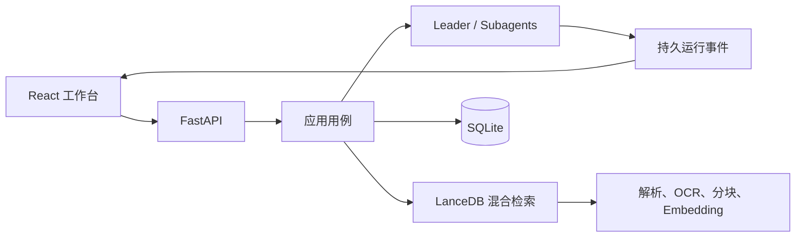

<p align="center">
  
</p>

<h1 align="center">PaperSage</h1>

<p align="center">一个面向文献阅读、可追溯证据与研究协作的 AI 工作台。</p>

<p align="center">
  <a href="https://github.com/0verL1nk/PaperSage/actions/workflows/quality.yml"></a>
  <a href="https://pypi.org/project/paper-sage/"></a>
  <a href="LICENSE"></a>
</p>


PaperSage 把资料库、研究会话、证据、长期记忆和多 Agent 协作收敛到同一个研究项目。资料可在后台完成 OCR 与索引，研究者无需等待，就能开始提问、比较方法、整理观点，并回到原文验证结论。

## 为什么使用 PaperSage

| 你需要的能力 | PaperSage 的实现 |
| --- | --- |
| 读得快，也能核对 | LanceDB 混合检索、重排与可点击证据；OCR 坐标可定位并高亮原文页。 |
| 上传资料不打断思路 | PDF、Office、图片与文本异步提取、OCR、分块和 Embedding；会话可立即开始。 |
| 把复杂研究做成过程 | 主会话与探索分支、可恢复运行事件、研究记忆和受控 A2UI 思维导图。 |
| 协作不变成黑盒 | Leader 按任务委派 researcher、reviewer、writer；界面只展示用户需要的真实进度与证据。 |

## 快速开始

### 桌面版（推荐）

从 [Releases](https://github.com/0verL1nk/PaperSage/releases) 下载适合 Windows、macOS 或 Linux 的安装包。桌面版内置前端与本地 FastAPI 服务，并提供自动更新、诊断日志和原生文件能力。

### 从源码运行

需要 Python 3.11+、[uv](https://docs.astral.sh/uv/)、Node.js 22+ 与 pnpm 11：

```bash
corepack enable
make install-dev
make web-install
make run
```

打开 `http://127.0.0.1:5173`。生产模式使用：

```bash
make web-build
make serve
```

### PyPI

发布工作流会把生产 Web bundle 纳入 `paper-sage` wheel。自下一次发布起，可通过：

```bash
pip install paper-sage
paper-sage
```

在 `http://127.0.0.1:8000` 启动完整 Web 应用；这不会启动 Vite。

## 系统概览


```mermaid
flowchart LR
  UI[React 工作台] --> API[FastAPI]
  API --> APP[应用用例]
  APP --> AGENT[Leader / Subagents]
  APP --> RAG[LanceDB 混合检索]
  APP --> DB[(SQLite)]
  RAG --> DOC[解析、OCR、分块、Embedding]
  AGENT --> SSE[持久运行事件]
  SSE --> UI
```

- Web：Vite、React、TypeScript、Tailwind、shadcn/ui、Radix、TanStack Query/Router、Zustand。
- Backend：FastAPI；代码保持 `UI → application → domain` 分层。
- Data：SQLite 保存项目与会话，LanceDB 保存向量索引，LangGraph checkpoint 保存 Agent 状态。

更多细节见：[Web 架构](docs/architecture/web-application.md)、[Agent 运行时](docs/architecture/agent-runtime.md)、[桌面端](docs/architecture/desktop-application.md)。

## 文档与文件处理

Office 文档会通过本机 Microsoft Office 或 LibreOffice 转为 PDF；随后由 PaddleOCR 保留页面、坐标和置信度。缺少转换器时，应用会在设置中给出安装指引。模型首次使用时下载到本地缓存，不塞进安装包。

配置可放在 `.env`，也可在设置中保存用户级模型配置。请从 [.env.example](.env.example) 开始，绝不提交 API Key、签名证书或公证凭据。

## 开发与贡献

```bash
make check          # 快速门禁
make ci             # 完整离线 CI
make test-unit      # Python 单测
make web-test       # 前端测试
make quality-full   # Python 与前端静态检查
```

提交请使用 Conventional Commits：`feat:` 触发 minor，`fix:`（含安全修复）触发 patch，`!` 或 `BREAKING CHANGE:` 触发 major。`Prepare Release` 会自动生成并同步版本发布 PR；合并后在该提交打 `vX.Y.Z` tag，唯一的 Desktop Release 工作流会在所有三端构建通过后发布完整资产。

贡献前请阅读 [AGENTS.md](AGENTS.md)。PR 需要说明问题、改动范围、风险、回滚方式和验证命令。安全问题请遵循 [SECURITY.md](SECURITY.md) 进行私密报告。

## License

[MIT](LICENSE)
