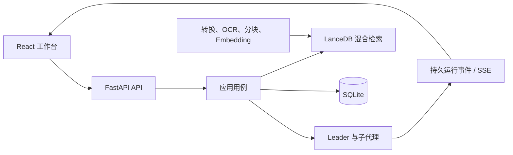

<p align="center">
  
</p>

<h1 align="center">PaperSage</h1>

<p align="center">面向本地资料的可追溯 AI 研究工作台。</p>

<p align="center">
  <a href="https://github.com/0verL1nk/PaperSage/actions/workflows/quality.yml"></a>
  <a href="https://github.com/0verL1nk/PaperSage/releases"></a>
  <a href="https://pypi.org/project/paper-sage/"></a>
  <a href="LICENSE"></a>
</p>


PaperSage 把资料库、研究会话和引用证据放在同一个项目里。导入自己的文档后，可以立刻开始提问；解析、OCR 和索引在后台完成。每个结论都应能回到对应资料的页面和位置核对，而不只是得到一段聊天回答。

## 从资料到结论

1. **导入资料**：一次上传 PDF、DOCX、PPTX、XLSX、图片或 TXT。文件会异步经历转换、OCR、分块和完整索引，不阻塞新会话。
2. **发起研究**：在主会话中提问，或从当前讨论创建探索分支。系统从已就绪的项目资料中检索相关内容，并可按任务委派研究、审阅或写作角色。
3. **核对证据**：回答中的引用可以打开原始文档。对已 OCR 的页面，PaperSage 会根据保存的页码、坐标和置信度定位证据位置。

| 你会用到的能力 | PaperSage 如何实现 |
| --- | --- |
| 不被上传过程打断 | 资料处理是异步的；索引未完成时仍可开始会话，完成后自动进入检索范围。 |
| 回答可复查 | LanceDB 的向量与全文混合检索只使用完整发布的文档版本；候选检索和最终引用分开呈现。 |
| 研究可以延续 | 项目保存会话、分支、资料范围和长期记忆；运行事件与流式回复支持离开后重新进入。 |
| 复杂任务有分工 | Leader 仅在当前请求内调用 researcher、reviewer、writer 等子代理；它们不是脱离当前会话的后台任务。 |

## 核心能力

- **项目式研究空间**：一个项目拥有自己的资料库、主会话、探索分支、检索范围与记忆，避免不同课题混入同一上下文。
- **多格式资料库**：支持 PDF、DOCX、PPTX、XLSX、图片与 TXT。处理状态从排队到发布可见，失败资料可重试。
- **混合 RAG 与证据预览**：Dense 向量、全文检索和 RRF 共同召回；回答只引用实际采用的证据，点击后可查看原文页面与 OCR 高亮位置。
- **研究协作而非黑盒进度**：Leader 根据问题调用研究、审阅和写作角色；界面展示实际的工具、委派与资料状态，而不是虚构的“思考过程”。
- **可恢复的研究过程**：SQLite 保存项目、消息、资料状态和运行事件；流式会话在重进页面后可恢复显示，长期记忆在对话结束后异步整理。
- **桌面与浏览器共用界面**：Vite/React 前端同时服务 Web 和 Electron；桌面端增加本地文件、更新、窗口控制和诊断日志。

## Agent 设计：让协作可验证

PaperSage 的 Agent 设计重点不是堆叠角色，而是让一次研究任务的边界清楚、证据可追溯、状态可恢复：

| 设计 | 对用户的意义 |
| --- | --- |
| **受约束的任务委派** | Leader 使用统一的 `task` 能力调用 researcher、reviewer、writer。角色定义在启动时校验；子代理不能递归委派，避免任务树失控。相同角色可以被多次调用，独立任务可在当前请求内并行。 |
| **委派与证据绑定** | 每项委派都有开始、完成、实际耗时和关联证据。最终回答只展示真实发生的检索、工具调用和引用，不把执行日志伪装成模型思维链。 |
| **动态资料范围** | 文档只有在 OCR、分块和索引完整发布后才进入检索；每次工具调用都会读取最新可用资料清单，既不会引用半成品，也不用重建会话。 |
| **两层记忆** | 当前会话由 Agent 的消息压缩维持上下文；长期记忆在每轮后异步由模型进行结构化增删改，再用语义检索取回。它不依赖关键词规则或固定摘要模板。 |
| **持久运行与重连** | 运行事件、消息和 Agent checkpoint 分别持久化。用户离开后重新进入会话，前端可以恢复已发生的过程和持续中的流式结果。 |
| **受验证的生成式界面** | 思维导图等 A2UI 产物经过受限 schema 验证后才渲染，模型不能任意注入前端组件或执行代码。 |

## 30 秒开始

### 使用桌面版

从 [Releases](https://github.com/0verL1nk/PaperSage/releases) 下载 Windows、macOS 或 Linux 安装包。桌面版复用同一套 Web 界面，内置本地 API、文件能力、诊断日志与更新机制。

### 从源码运行

需要 Python 3.11+、[uv](https://docs.astral.sh/uv/)、Node.js 22+ 和 pnpm 11+：

```bash
corepack enable
make install-dev
make web-install
make run
```

然后打开 `http://127.0.0.1:5173`。`make run` 会同时启动 FastAPI（`:8000`）和 Vite 开发服务器（`:5173`）。

生产式本地运行：

```bash
make web-build
make serve
```

此模式由 FastAPI 在 `http://127.0.0.1:8000` 托管已构建的前端。

### 使用 PyPI 包

发布版本将 Web bundle 一并包含在 `paper-sage` wheel 中：

```bash
pip install paper-sage
paper-sage
```

这会启动本机服务；随后访问 `http://127.0.0.1:8000`，不会额外启动 Vite。

## 文档、模型与数据

- **文档处理**：PDF、图片和 TXT 会转换为可检索页面；Word、PowerPoint 与 Excel 会先使用本机 Microsoft Office，或 LibreOffice 后备方案转换为 PDF，再进入 PaddleOCR 流程。
- **证据定位**：OCR 保存页码、文本多边形和置信度。跨页段落或表格可以保留多个页面位置，供预览和高亮使用。
- **本地优先**：项目、会话和资料索引默认保存在本机的 SQLite 与 LanceDB 中。OCR 模型首次使用时下载到本地缓存，不预置到安装包。
- **模型与联网**：回答模型由你在设置或 `.env` 中配置；若启用 Web 搜索，查询会发送到所选搜索服务。请根据你的模型与搜索服务政策处理敏感资料。

从 [.env.example](.env.example) 复制配置模板。不要提交 API Key、签名证书或其他凭据。

## 处理链路


```mermaid
flowchart LR
  A[导入资料] --> B[转换与 OCR]
  B --> C[分块与索引]
  C --> D[混合检索]
  D --> E[带引用的回答]
  E --> F[打开原文并定位]
```

前端使用 Vite、React、TypeScript、Tailwind、shadcn/ui、Radix 和 TanStack；FastAPI 提供 API 边界。SQLite 保存项目与会话，LanceDB 保存项目级索引，Agent 状态和运行事件用于恢复研究过程。详见：[Web 架构](docs/architecture/web-application.md)、[Agent 运行时](docs/architecture/agent-runtime.md)、[桌面端](docs/architecture/desktop-application.md)。

部署 durable Agent worker、检查运行指标和处理 lease/outbox 事故，请参阅[运行手册](docs/operations/durable-agent-runtime.md)。

思维导图等生成式界面只是回答内的补充：模型先提交受限的 surface 请求，再继续输出正常 Markdown 与证据。服务端验证 catalog、规模和证据 ID，前端不会执行模型生成的代码。详见 [A2UI 表现层](docs/architecture/a2ui.md)。

## 系统架构


```mermaid
flowchart LR
  UI[React 工作台] --> API[FastAPI API]
  API --> APP[应用用例]
  APP --> AGENT[Leader 与子代理]
  APP --> RAG[LanceDB 混合检索]
  APP --> DB[(SQLite)]
  DOC[转换、OCR、分块、Embedding] --> RAG
  AGENT --> EVENTS[持久运行事件 / SSE]
  EVENTS --> UI
```

依赖方向保持 `UI → application → domain`：界面只处理交互与状态展示；用例层编排研究和资料处理；adapter 层接入模型、文件、SQLite、LanceDB 与外部服务。桌面端仅在共享 Web 应用外增加受限的 Electron 桥接，不把桌面逻辑混入业务用例。

## 开发

```bash
make check          # 快速质量门禁
make ci             # 完整离线 CI
make test-unit      # Python 单元测试
make web-test       # 前端测试
make desktop-dev    # Electron 开发壳
```

目录边界与质量要求见 [AGENTS.md](AGENTS.md)。提交使用 Conventional Commits：`feat:` 触发 minor，`fix:` 触发 patch，`!` 或 `BREAKING CHANGE:` 触发 major。Release Please 会持续汇总同一份版本 PR；发布列车在工作日北京时间 09:00 自动合并通过门禁的版本 PR、创建 `vX.Y.Z` tag，并启动统一的桌面端与 PyPI 发布流程。

## 贡献与安全

PR 请说明问题、变更范围、风险、回滚方式及验证命令。安全问题请遵循 [SECURITY.md](SECURITY.md) 私密报告，而不要直接公开提交凭据或漏洞细节。

## License

[MIT](LICENSE)
