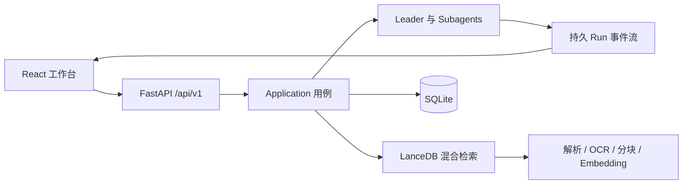

# PaperSage

> 面向科研阅读、可追溯证据与多 Agent 协作的项目式研究工作台。


PaperSage 将文献、会话、检索证据、长期记忆与 Agent 活动统一放进研究项目。上传资料后，解析、OCR 与索引在后台进行；用户可以立即开始对话，资料就绪后自动进入后续检索范围。

资料在本地后台按统一流程处理：PDF、图片、TXT 直接渲染为页面；Word、PowerPoint、Excel 先由本机 Microsoft Office 或 LibreOffice 转为 PDF。随后使用 PaddleOCR 逐页识别并保存页面、坐标与置信度，因此回答中的引用可以打开对应原文页并高亮。模型首次使用时下载到本地缓存，不会预置进桌面安装包。

## 核心能力

- **项目式研究空间**：项目拥有资料库、主会话与分支会话、证据、记忆和研究活动，避免跨任务混杂上下文。
- **可追溯问答**：项目级 RAG 使用 LanceDB、Dense 向量、全文检索与 RRF 混合召回；回答中的证据可打开原文页并按 OCR 坐标高亮。
- **异步资料处理**：多文件上传后依次经历提取、OCR、分块、Embedding 与发布，前端显示真实进度且不阻塞会话。
- **多 Agent 协作**：Leader 可委派 researcher、reviewer、writer 等子 Agent；委派和工具调用由持久事件流驱动，而非模拟进度。
- **持久化研究过程**：SQLite 保存项目、消息、运行事件和摄取状态，LangGraph checkpoint 保存 Agent 状态；中途离开后可恢复运行与流式答案。
- **研究产物**：支持证据引用、Markdown/KaTeX 渲染、上下文检查器，以及受限 A2UI 协议生成的思维导图。

## 使用方式

1. 新建或选择一个研究项目。
2. 在“资料库”中一次上传多份 PDF、DOCX、PPTX、XLSX、图片或文本资料；不必等待索引完成。
3. 进入主会话提问，或在需要探索不同方向时创建分支会话。
4. 在回答侧边检查器中查看引用证据、资料状态与实际执行活动。

## 架构概览


```mermaid
flowchart LR
  UI[React 工作台] --> API[FastAPI /api/v1]
  API --> APP[Application 用例]
  APP --> AGENT[Leader 与 Subagents]
  APP --> RAG[LanceDB 混合检索]
  APP --> DB[(SQLite)]
  RAG --> DOC[解析 / OCR / 分块 / Embedding]
  AGENT --> SSE[持久 Run 事件流]
  SSE --> UI
```

前端是独立的 Vite + React 应用：TanStack Router 管理可导航状态，TanStack Query 管理服务端缓存与轮询，Zustand 仅保存 UI 状态，shadcn/ui 与 Radix UI 提供无障碍组件基础。后端使用 FastAPI 作为传输边界，`agent/domain`、`agent/application` 和 `agent/adapters` 保持分层；UI 不直接调用模型或数据库。

更多设计细节见：[Web 应用架构](docs/architecture/web-application.md)、[Agent 运行时](docs/architecture/agent-runtime.md)、[桌面应用](docs/architecture/desktop-application.md)。

## 快速开始

### 环境要求

- Python 3.11+
- [uv](https://docs.astral.sh/uv/)
- Node.js 22+
- pnpm 11（建议通过 Corepack 使用）

```bash
corepack enable
make install-dev      # 安装 Python 开发依赖
make web-install      # 按 pnpm-lock.yaml 安装前端依赖
make run              # 同时启动 API :8000 和 Vite :5173
```

浏览器打开 `http://127.0.0.1:5173`。也可以分别启动：

```bash
make api-dev          # FastAPI，支持 reload
make web-dev          # Vite 开发服务器
```

生产构建由 FastAPI 托管前端静态文件：

```bash
make web-build
make serve            # http://127.0.0.1:8000
```

## 桌面端

桌面版将 React 前端与 FastAPI 服务一起打包为 Electron 应用，并使用应用内自定义标题栏。

```bash
make desktop-dev
make desktop-package-win    # Windows NSIS
make desktop-package-mac    # 仅 macOS 上执行，生成 DMG
make desktop-package-linux  # 仅 Linux 上执行，生成 AppImage 与 deb
```

发布 `vX.Y.Z` tag 时，GitHub Actions 会在 Windows、macOS、Linux 原生 runner 上构建安装包、构建 Python wheel/sdist，并在所有桌面构建成功后由单一工作流一次性创建 GitHub Release 与 SHA-256 清单。版本号必须同时匹配 `pyproject.toml` 与 `web/package.json`。具体的签名、公证和验证操作见[桌面发布运维说明](docs/architecture/desktop-release.md)。

版本由 `Prepare Release` 自动生成发布 PR：`feat:` 升 minor，`fix:` 与安全修复升 patch，`feat!:`、`fix!:` 或 `BREAKING CHANGE:` 升 major。合并该 PR 后，确认版本内容并推送对应 `vX.Y.Z` tag；只有 Desktop Release 会创建 GitHub Release。

PyPI 的 `paper-sage` wheel 包含已构建的 Web 前端。安装后运行 `paper-sage`（或 `papersage`）会启动本机 FastAPI 服务，并在 `http://127.0.0.1:8000` 提供完整 Web 界面；开发时仍使用 `make run` 启动 API 与 Vite 热更新服务。

## 项目结构

```text
api/                    # FastAPI 路由、schema 与 HTTP transport
web/
  src/components/       # 应用壳、领域组件与 shadcn/ui 组件
  src/pages/            # 项目、研究、资料库、设置页面
  src/lib/              # API client、Zod schema、Query hooks、平台边界
  src/stores/           # Zustand UI 状态
  electron/             # Electron main / preload / 开发启动器
agent/
  domain/               # 领域模型与契约
  application/          # 用例编排
  adapters/             # SQLite、LanceDB、文件、模型等外部适配
  subagent/             # 子 Agent 定义与协作能力
tests/                  # 单元、集成与评测
docs/architecture/      # 架构与运维文档
```

## 配置

复制 `.env.example` 为 `.env`，或在应用“设置”中保存用户级模型配置。密钥仅由后端读取，API 不会返回完整密钥。

```bash
# OpenAI-compatible 模型服务
OPENAI_COMPATIBLE_BASE_URL=https://your-provider.example/v1
OPENAI_MODEL_NAME=your-model
OPENAI_API_KEY=your-secret

# 项目级 RAG：0 表示不限制资料规模
AGENT_LANCEDB_DIR=./.cache/lancedb
LOCAL_RAG_PROJECT_MAX_CHARS=0
LOCAL_RAG_PROJECT_MAX_CHUNKS=0
RAG_INDEX_BATCH_SIZE=256

# 可选：PaddleOCR 模型缓存与 Office 转换器路径
AGENT_OCR_CACHE_DIR=./.cache/paddleocr
LIBREOFFICE_BIN=

# 可选：Web 搜索与 Redis 队列
BRAVE_SEARCH_API_KEY=
REDIS_HOST=localhost
```

不要提交 `.env`、API Key、签名证书或 Apple notarization 凭据。完整配置项见 [.env.example](.env.example)。

Office 文档预览依赖本机 Microsoft Office 桌面版或 LibreOffice；缺少时，设置页会说明如何安装。历史资料需要在资料库中点击“重试”后才会生成可定位的页面预览。

## 开发与质量门禁

```bash
make check             # 快速本地门禁：核心 lint/typecheck、Web 检查、单测
make ci                # 完整离线 CI：锁文件、质量、前端测试/构建、全量测试
make test-unit         # Python 单元测试
make web-test          # Vitest 前端组件测试
make quality-full      # Python + 前端 lint/typecheck
make test-evals        # 离线 Agent 评测
```

变更请遵守 [AGENTS.md](AGENTS.md)：保持 `UI → application → domain` 的依赖方向，业务改动附带测试和文档，并避免把运行时编排或数据访问写入 UI。

## 贡献

提交前至少运行与改动范围对应的测试。Pull Request 请说明问题背景、变更范围、风险与回滚方式，并附上执行过的验证命令。详细工程约束与评审清单见 [AGENTS.md](AGENTS.md)。

## License

本项目采用 [MIT License](LICENSE)。
