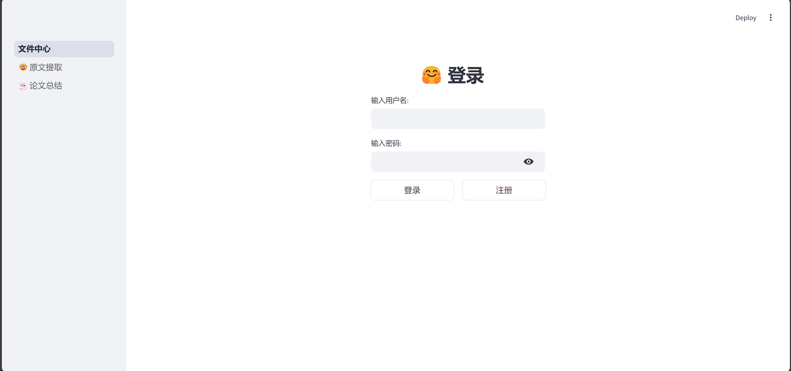

# 文献阅读助手
[English](README_EN.md) | 简体中文

一个基于人工智能的文献阅读辅助工具，帮助研究人员和学生更高效地阅读、理解和分析学术文献。

## ✨ 主要特性

- 🔐 完整的用户系统（登录/注册）
- 📁 文件管理中心
- 📑 智能文献分析
  - 自动提取关键原文和标注
  - 生成文献总结
  - 智能降重和文段优化
  - 交互式论文问答
- 🗺️ 可视化思维导图
  - 基于 st_pyecharts 和 pyecharts.charts.Tree 实现
  - 直观展示文献结构和关键概念

## 🚀 快速开始

### 环境要求
- Python 3.9+ (langchain 0.3.7+ 需要 Python 3.9+)
- [uv](https://github.com/astral-sh/uv) (推荐的包管理器，速度更快)

### 安装 uv

```bash
# Linux/MacOS
curl -LsSf https://astral.sh/uv/install.sh | sh

# Windows
powershell -c "irm https://astral.sh/uv/install.ps1 | iex"

# 或使用 pip
pip install uv
```

### 安装步骤

1. **克隆仓库**      
```bash
git clone <仓库地址>
cd <项目目录>   
```

2. **使用 uv 安装依赖**      
```bash
# uv 会自动创建虚拟环境并安装依赖
# 使用 --no-install-project 只安装依赖，不安装项目本身（因为这是应用而非库）
uv sync --no-install-project
```

3. **激活虚拟环境（可选）**      
```bash
# Linux/MacOS
source .venv/bin/activate

# Windows
.venv\Scripts\activate
```

4. **运行项目**      
```bash
streamlit run 文件中心.py   
```

> 💡 **提示**：项目已配置禁用 Streamlit 使用统计收集，启动时不会要求输入邮箱。

5. **访问应用**
打开浏览器访问 `http://localhost:8501`

### 其他 uv 命令

```bash
# 添加新依赖
uv add <package-name>

# 移除依赖
uv remove <package-name>

# 更新所有依赖
uv sync --upgrade

# 查看依赖树
uv tree
```

## 📸 功能展示

### 登录界面


### 文件中心


### 原文提取


### 文段优化


### 论文问答


### 思维导图


## 🛠️ 技术栈

- 前端：Streamlit
- 后端：Python
- 可视化：pyecharts

## 🗺️ 开发路线图

- [x] 用户系统
- [x] 文件中心
- [x] 文献分析核心功能
- [x] 思维导图可视化
- [x] 集成 LangChain 框架
- [ ] 重构：将 utils 迁移到独立文件夹
- [ ] ~~一键翻译论文~~ (已搁置)

## 📝 注意事项

- 项目使用 `uv` 进行依赖管理，比传统 pip 更快更可靠
- 如果没有安装 uv，也可以使用传统的 pip + requirements.txt 方式安装依赖
- 记得在应用中配置您的 API Key（在侧边栏设置中）

## 🤝 贡献指南

欢迎提交 Issue 和 Pull Request 来帮助改进项目！


