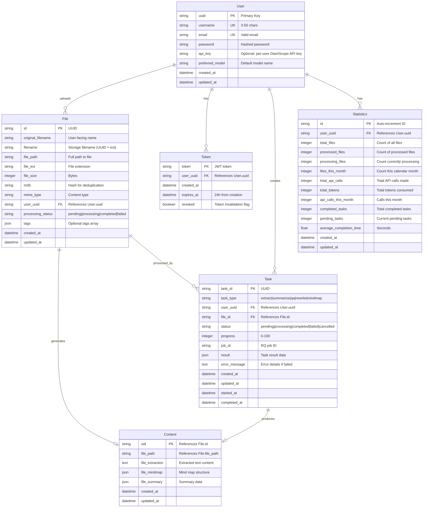

# Data Model: FastAPI Backend

## Entity Relationships



## Entity Details

### 1. User Entity

**Purpose**: Represents authenticated users with configuration

**Fields**:
- `uuid` (str, PK): Unique identifier, UUID format
- `username` (str): 3-50 characters, unique, alphanumeric + underscore
- `email` (str): Valid email format, unique
- `password` (str): Hashed password (bcrypt/scrypt)
- `api_key` (str, optional): User's DashScope API key for personal usage
- `preferred_model` (str): Default LLM model (e.g., "qwen-max")
- `created_at` (datetime): Account creation timestamp
- `updated_at` (datetime): Last profile update

**Validation Rules**:
- Username must be unique (case-insensitive)
- Email must be unique (case-insensitive)
- Password minimum 8 characters
- API key is optional but required for using own key

**State Transitions**:
- Created → Active
- Active → Active (on update)
- Password changes require re-authentication

**Relationships**:
- Has many Files, Tokens, Tasks, Statistics

---

### 2. Token Entity

**Purpose**: JWT authentication tokens with expiration

**Fields**:
- `token` (str, PK): JWT token string
- `user_uuid` (str, FK): References User.uuid
- `created_at` (datetime): Token creation time
- `expires_at` (datetime): 24 hours from creation
- `revoked` (bool): Manual token invalidation

**Validation Rules**:
- Token must be valid JWT format
- Expiration must be exactly 24 hours from creation
- Each token belongs to one user
- Multiple active tokens allowed per user

**State Transitions**:
- Created → Active (valid)
- Active → Expired (after expires_at)
- Active → Revoked (on logout)

**Relationships**:
- Belongs to User

---

### 3. File Entity

**Purpose**: Uploaded documents with metadata

**Fields**:
- `id` (str, PK): UUID identifier
- `original_filename` (str): User-provided filename
- `filename` (str): UUID-based storage filename
- `file_path` (str): Full path in uploads directory
- `file_ext` (str): File extension (.pdf, .docx, .txt)
- `file_size` (int): Size in bytes
- `md5` (str): MD5 hash for deduplication
- `mime_type` (str): Content-Type header value
- `user_uuid` (str, FK): Owner's UUID
- `processing_status` (str): Current status
- `tags` (json): Optional string array
- `created_at` (datetime): Upload timestamp
- `updated_at` (datetime): Last status change

**Validation Rules**:
- File size limit: 50MB
- Supported extensions: .pdf, .docx, .txt
- File size > 0 bytes
- MD5 hash computed for deduplication
- Tags are optional, max 10 per file

**State Transitions**:
- pending → processing → completed
- pending → processing → failed
- failed → processing (on retry)

**Relationships**:
- Belongs to User
- Has one Content
- Has many Tasks

---

### 4. Content Entity

**Purpose**: Generated content (text extraction, summaries, mindmaps)

**Fields**:
- `uid` (str, PK, FK): References File.id (one-to-one)
- `file_path` (str): Redundant reference for performance
- `file_extraction` (text): Raw extracted text
- `file_mindmap` (json): Hierarchical mind map structure
- `file_summary` (json): Summary data with statistics
- `created_at` (datetime): First content generation
- `updated_at` (datetime): Last content update

**Validation Rules**:
- One Content per File (one-to-one)
- All fields optional (incremental generation)
- file_extraction must be text
- file_mindmap and file_summary are JSON structures
- Maximum size for JSON fields: 10MB

**State Transitions**:
- Created when first task completes
- Updated when additional content generated

**Relationships**:
- Belongs to File (one-to-one)
- Produced by Tasks

---

### 5. Task Entity

**Purpose**: Async operations tracking

**Fields**:
- `task_id` (str, PK): UUID identifier
- `task_type` (str): Task type identifier
- `user_uuid` (str, FK): Owner's UUID
- `file_id` (str, FK): Target file
- `status` (str): Current state
- `progress` (int): Completion percentage 0-100
- `job_id` (str): RQ worker job ID
- `result` (json): Task result data
- `error_message` (str): Error details if failed
- `created_at` (datetime): Task creation
- `updated_at` (datetime): Last status change
- `started_at` (datetime, nullable): When processing began
- `completed_at` (datetime, nullable): When finished

**Validation Rules**:
- task_type must be valid: extract|summarize|qa|rewrite|mindmap
- progress must be 0-100
- status must be valid state
- result is optional (only present when completed)
- error_message only present when failed
- started_at must be before completed_at

**State Transitions**:
- pending → processing → completed
- pending → processing → failed
- pending → cancelled
- Any → cancelled (graceful shutdown)

**Relationships**:
- Belongs to User
- Belongs to File
- Produces Content (via results)

**Task Types**:
1. **extract**: Text extraction from documents
2. **summarize**: Document summarization
3. **qa**: Question answering
4. **rewrite**: Text rewriting
5. **mindmap**: Mind map generation

---

### 6. Statistics Entity

**Purpose**: Aggregated usage metrics per user

**Fields**:
- `id` (int, PK): Auto-increment ID
- `user_uuid` (str, UK): Unique per user
- `total_files` (int): All files uploaded
- `processed_files` (int): Files successfully processed
- `processing_files` (int): Currently processing
- `files_this_month` (int): Uploaded this calendar month
- `total_api_calls` (int): Total LLM API calls
- `total_tokens` (int): Total tokens consumed
- `api_calls_this_month` (int): Calls this month
- `completed_tasks` (int): Total completed tasks
- `pending_tasks` (int): Current pending tasks
- `average_completion_time` (float): Average task time in seconds
- `created_at` (datetime): Record creation
- `updated_at` (datetime): Last recalculation

**Validation Rules**:
- One Statistics per User (one-to-one)
- All counters >= 0
- average_completion_time can be 0 or positive
- updated_at ≥ created_at

**State Transitions**:
- Created when first file uploaded
- Updated on each operation
- Incremental updates (not recalculation)

**Relationships**:
- Belongs to User (one-to-one)

---

## Database Schema Migration

### Existing Schema (from utils/utils.py)

```sql
CREATE TABLE users (
    uuid VARCHAR PRIMARY KEY,
    username VARCHAR UNIQUE,
    password VARCHAR,
    api_key VARCHAR,
    model_name VARCHAR
);

CREATE TABLE tokens (
    token VARCHAR PRIMARY KEY,
    user_id VARCHAR,
    created_at DATETIME,
    expires_at DATETIME
);

CREATE TABLE files (
    id INTEGER PRIMARY KEY AUTOINCREMENT,
    original_filename VARCHAR,
    uid VARCHAR,
    md5 VARCHAR,
    file_path VARCHAR,
    uuid VARCHAR,
    created_at DATETIME
);

CREATE TABLE contents (
    uid VARCHAR PRIMARY KEY,
    file_path VARCHAR,
    file_extraction TEXT,
    file_mindmap TEXT,
    file_summary TEXT
);

CREATE TABLE task_status (
    task_id VARCHAR PRIMARY KEY,
    uid VARCHAR,
    content_type VARCHAR,
    status VARCHAR,
    created_at DATETIME,
    updated_at DATETIME,
    error_message TEXT,
    job_id VARCHAR
);
```

### Migration to SQLAlchemy Models

**Changes Needed**:
1. Add `user_uuid` field to `files` table
2. Add `user_uuid` field to `task_status` table
3. Add `processing_status` and metadata to `files`
4. Rename `task_status` to `tasks` for clarity
5. Add Statistics table
6. Update UUID fields to proper UUID type

**Migration Script**:

```sql
-- Add user relationship to files
ALTER TABLE files ADD COLUMN user_uuid VARCHAR;

-- Add user relationship to task_status
ALTER TABLE task_status ADD COLUMN user_uuid VARCHAR;

-- Add processing status to files
ALTER TABLE files ADD COLUMN processing_status VARCHAR DEFAULT 'pending';
ALTER TABLE files ADD COLUMN file_size INTEGER;
ALTER TABLE files ADD COLUMN mime_type VARCHAR;
ALTER TABLE files ADD COLUMN tags TEXT;
ALTER TABLE files ADD COLUMN updated_at DATETIME;

-- Rename task_status to tasks
ALTER TABLE task_status RENAME TO tasks;

-- Add fields to tasks
ALTER TABLE tasks ADD COLUMN file_id VARCHAR;
ALTER TABLE tasks ADD COLUMN progress INTEGER DEFAULT 0;
ALTER TABLE tasks ADD COLUMN result TEXT;
ALTER TABLE tasks ADD COLUMN started_at DATETIME;
ALTER TABLE tasks ADD COLUMN completed_at DATETIME;

-- Add Statistics table
CREATE TABLE IF NOT EXISTS statistics (
    id INTEGER PRIMARY KEY AUTOINCREMENT,
    user_uuid VARCHAR UNIQUE,
    total_files INTEGER DEFAULT 0,
    processed_files INTEGER DEFAULT 0,
    processing_files INTEGER DEFAULT 0,
    files_this_month INTEGER DEFAULT 0,
    total_api_calls INTEGER DEFAULT 0,
    total_tokens INTEGER DEFAULT 0,
    api_calls_this_month INTEGER DEFAULT 0,
    completed_tasks INTEGER DEFAULT 0,
    pending_tasks INTEGER DEFAULT 0,
    average_completion_time REAL DEFAULT 0.0,
    created_at DATETIME DEFAULT CURRENT_TIMESTAMP,
    updated_at DATETIME DEFAULT CURRENT_TIMESTAMP
);
```

## Validation Rules Summary

### Input Validation
- All API endpoints validate inputs using Pydantic
- File uploads: size < 50MB, type in [pdf, docx, txt]
- Authentication: username 3-50 chars, email valid format, password ≥ 8 chars
- Pagination: page_size ≤ 100
- Task progress: 0-100 inclusive

### Business Rules
- MD5 deduplication on file upload
- JWT token expires after 24 hours
- One user can have multiple active tokens
- One content per file (one-to-one)
- One statistics per user (one-to-one)
- Tasks are idempotent (can retry)

### Security Rules
- API keys stored per-user (optional)
- All endpoints require authentication except register/login
- File access restricted to owner
- Task access restricted to owner
- Sensitive fields excluded from responses (password, api_key)